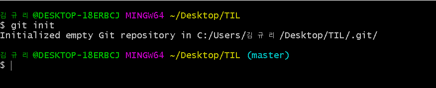
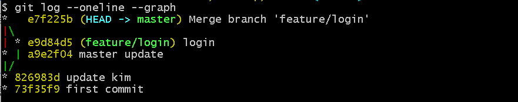

# Git Command

> Git 명령어 정리

## 초기 설정

### 0. init

- `git init`

- `.git/` 폴더를 생성해준다.

  

- `.git` 폴더가 생성된 경우 오른쪽에 `master` 라는 표시가 나온다
- 최초에 한번만 하면된다.

### 1. config

- `git config --glovla user.email "myemail@gmail.com" `
  - 이메일의 경우 깃헙에 올릴경우 잔디가 심어지는 기준이므로 정확하게 입력!
- `git config --global user.name "myname"`
- 최초에 한번만 하면된다.

## 커밋 기록

### 1. add

- `git add <추가하고 싶은 파일>`
  - `git add . `:현재 폴더의 모든 파일과 폴더를 add
- working directory => staging area로 파일 이동

### 2. commit

- `git commit -m "메세지"`
- 스냅샷을 찍는 동작
- add 되어 있는 파일들을 하나의 묶음으로 저장
- 메세지에 들어가는 내용은 기능 단위로

### 3. remote 

- `git remote add origin <주소>`
- 원격 저장소와 현재 로컬 저장소를 연결.
- 한번만 진행

### 4. push

- `git push origin master`
- 깃아 올려줘 origin으로, master를
- 원격저장소에, 로컬저장소의 데이터를

## 상태확인

### 1. status

- `git status`

- 현재 git 상태를 출력

- 해당 git에 수정사항이 있는지 확인

### 2. log

- `git log`

- 커밋 기록을 전체 다 출력

- 옵션

  - `--oneline` : author, date 같은 정보를 제외하고 한줄로 출력
  - `graph`: 커밋들을 점으로 표현하고 그 커밋을 선으로 연결해서 그래프 형태로 출력

### 3. diff

- `git diff`
- 현재 변경사항을 체크(add하기전에)

## 추가파일

### 1. gitignore

- `git ignore` 파일을 생성 후 git으로 관리하고 싶지 않은 파일들을 저장

- gitignore.io
- 이때 mac, window 둘다 넣어서 세팅 (팀원의 운영체제까지 고려)

## 브랜치

> branch 기능을 차곡차곡 생성 => branch를 병합 => branch 삭제

### 1. 생성

- `git branch <브랜치 이름>`
- branch는 기능별로 생성
- `git branch` : 생성된 브랜치를 확인 가능

### 2. 이동

- `git switch <브랜치 이름>` =>최신 문법
- `git checkout <브랜치 이름>`

### 3. 삭제

- `git branch -d <브랜치 이름>`

### 4. 병합

- `git merge <브랜치 이름>`
- base 가 되는 branch로 이동해서 명령어 사용
- 충돌이 발생한 경우 => 충돌을 해결하고 다시 add, commit, push 진행
- HEAD -> master, kim 이렇게 모두를 가리키면 병합 완료
- github에서 병합가능

## 불러오기

### 1. Pull

- `git pull origin master`

## 다른 사람 코드 수정해보기

### 1. fork

- 남이 만든 코드를 수정하고 싶은데 권한이 없을 때

  - github에서 내 repo로 fork

  - 내 repo에 fork된 프로젝트를 clone

  - git bash에서 `git clone <clone 주소>` 입력

    

